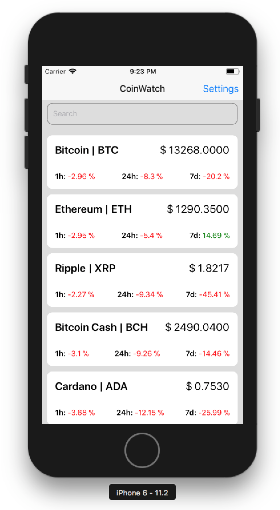

# React Foo Pune 2018 React Native Workshop

## What we will be building

## Setup

Setup steps can be found at https://facebook.github.io/react-native/docs/getting-started.html

**Note the two tabs at the top, one for 'Quick Start' and other for 'Build Projects with Native Code'**

If you own a Mac, it is recommended to setup your machine via the **"Build Projects with Native Code"** tab.

## Scripts

1. `yarn start` - To start the packager
2. `yarn ios` - To run on iOS
3. `yarn android` - To run on android
